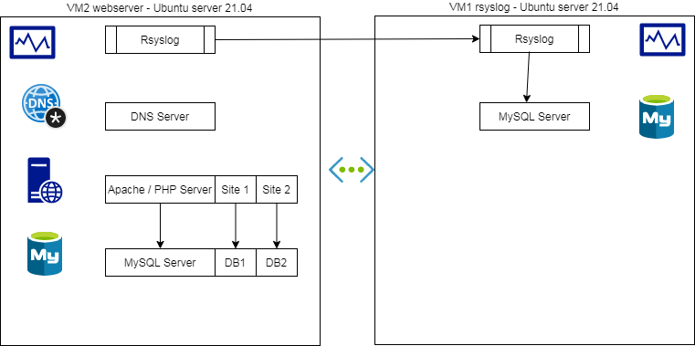

# Serveur de développement WEB

## 1 - Objectif

Créer un environnement de développement WEB permettant d'héberger plusieurs sites web sur un serveur apache disposant du module PHP et PDO. L'environnement de développement dispose d'un serveur syslog permettant de centraliser tous les logs provenant du serveur apache et du serveur mysql. Le reseau local dispose d'un domaine local nommé mips.lan qui est géré par un serveur DNS. Un fichier de configuration permet de créer les serveurs virtuels apache, le sous domaine correspondant au site web, ainsi que la base de données nécessaire pour chaque site web. 

Plan du réseau:


## 2 - Installation VM1
- VirtualBox
- distribution: ubuntu server 21.04
- RAM 1024 Mo
- HDD 10 Go
- Installer OpenSSH server
- IP: 192.168.1.202
- hostname: rsyslog

## 3 - Installation VM2
- distribution: ubuntu server 21.04
- RAM 1024 Mo
- HDD 10 Go
- Installer OpenSSH server
- IP: 192.168.1.203
- hostname: webserver

## 4 - Configuration réseau VM1

Configuration IP statique
```bash
sudo apt update
sudo apt upgrade

$ cd /etc/netplan
$ ls
00-installer-config.yaml
$ vi 00-installer-config.yaml
```

Contenu fichier configuration
```
network:
 version: 2
 renderer: networkd
 ethernets:
  eth0:
   dhcp4: no
   addresses: [192.168.1.202/24]
   gateway4: 192.168.1.1
   nameservers:
    addresses: [192.168.1.1]
```

Vérification de la configuration
```bash
sudo netplan apply
ip a
ip route
sudo hostnamectl set-hostname rsyslog
ping www.google.com
```

Configuration firewall
```bash
sudo ufw status
sudo ufw enable
sudo ufw allow ssh
sudo ufw status
```

Test accès SSH depuis poste de travail
```bash
ssh fab@192.168.1.202
```

## 5 - Configuration réseau VM2

Idem
Configuration firewall
```bash
sudo ufw status
sudo ufw enable
sudo ufw allow ssh
sudo ufw allow 80
sudo ufw allow 443
sudo ufw allow 3306
sudo ufw status
```


## 6 - VM1 - Installation serveur collecteur rsyslog
Cette configuration permet de collecter tous les messages syslog du réseau en TCP et UDP. Les
messages sont stockés dans une base de données MySQL.
Il est possible de stocker les messages syslog dans une grande variété de formats et de bases de
données.

### 6/1 - Étape 1: installer MySQL server

```bash
$ sudo apt install mysql-server
$ sudo systemctl status mysql
? mysql.service - MySQL Community Server
Loaded: loaded (/lib/systemd/system/mysql.service; enabled; vendor preset: en
Active: active (running) since Thu 2020-07-09 09:25:52 UTC; 21s ago
Main PID: 2450 (mysqld)
Tasks: 27 (limit: 2241)
CGroup: /system.slice/mysql.service
+-2450 /usr/sbin/mysqld --daemonize --pid-file=/run/mysqld/mysqld.pid
Jul 09 09:25:52 vm1 systemd[1]: Starting MySQL Community Server...
Jul 09 09:25:52 vm1 systemd[1]: Started MySQL Community Server.

$ sudo mysql
mysql> show databases;
+--------------------+
| Database |
+--------------------+
| information_schema |
| mysql |
| performance_schema |
| sys |
+--------------------+
4 rows in set (0.00 sec)
```

### 6/2 - étape 2 : configurer le firewall

```bash
$ sudo ufw allow 514
$ sudo ufw status verbose
Status: active
Logging: on (low)
Default: deny (incoming), allow (outgoing), disabled (routed)
New profiles: skip
To Action From
-- ------ ----
22/tcp ALLOW IN Anywhere
514 ALLOW IN Anywhere
22/tcp (v6) ALLOW IN Anywhere (v6)
514 (v6) ALLOW IN Anywhere (v6)
```

### 6/3 - étape 3: Configurer la réception UDP et TCP sur le port 514

```bash
$ cd /etc
$ sudo cp rsyslog.conf rsyslog.conf.bak
$ sudo vi rsyslog.conf
# provides UDP syslog reception
module(load="imudp")
input(type="imudp" port="514")
# provides TCP syslog reception
module(load="imtcp")
input(type="imtcp" port="514")
```

### 6/4 - étape 4: installer le support MySQL dans rsyslog

La base de données par défaut est Syslog
Pendant l'installation : mot de passe vide
```bash
$ sudo apt-get install rsyslog-mysql
$ sudo mysql
mysql> show databases;
+--------------------+
| Database |
+--------------------+
| information_schema |
| Syslog |
| mysql |
| performance_schema |
| sys |
+--------------------+
5 rows in set (0.00 sec)
```

La configuration du module de sortie MySQL se trouve dans le fichier /etc/rsyslog.d/mysql.conf
```
$ sudo cat mysql.conf
### Configuration file for rsyslog-mysql
### Changes are preserved

module (load="ommysql")
*.* action(type="ommysql" server="localhost" db="Syslog" uid="rsyslog" pwd="P@ssw0rd")
```

### 6/5 - étape 5: redemarrer le service rsyslog

```
$ sudo systemctl restart rsyslog
$ sudo systemctl status rsyslog
? rsyslog.service - System Logging Service
Loaded: loaded (/lib/systemd/system/rsyslog.service; enabled; vendor preset:
Active: active (running) since Thu 2020-07-09 12:52:47 UTC; 7s ago
Docs: man:rsyslogd(8)
http://www.rsyslog.com/doc/
Main PID: 4448 (rsyslogd)
Tasks: 10 (limit: 2241)
CGroup: /system.slice/rsyslog.service
+-4448 /usr/sbin/rsyslogd -n
Jul 09 12:52:47 vm1 systemd[1]: Starting System Logging Service...
Jul 09 12:52:47 vm1 systemd[1]: Started System Logging Service.
Jul 09 12:52:47 vm1 rsyslogd[4448]: imuxsock: Acquired UNIX socket '/run/systemd
Jul 09 12:52:47 vm1 rsyslogd[4448]: rsyslogd's groupid changed to 106
Jul 09 12:52:47 vm1 rsyslogd[4448]: rsyslogd's userid changed to 102
Jul 09 12:52:47 vm1 rsyslogd[4448]: [origin software="rsyslogd" swVersion="8.32
```

### 6/6 - étape 6 : tester en local

```
$ logger "TEST"
$ sudo mysql
mysql> use Syslog
Database changed
mysql> select * from SystemEvents where message like '%TEST%';
+----+------------+---------------------+---------------------+----------+----------+----------+---------
+------------+------------+-------------+-----------+---------------+---------+-----------------
+--------------+-----------+----------+----------+------------+-----------+--------------+-----------------
+----------+
| ID | CustomerID | ReceivedAt | DeviceReportedTime | Facility | Priority | FromHost |
Message | NTSeverity | Importance | EventSource | EventUser | EventCategory | EventID |
EventBinaryData | MaxAvailable | CurrUsage | MinUsage | MaxUsage | InfoUnitID |
SysLogTag | EventLogType | GenericFileName | SystemID |
+----+------------+---------------------+---------------------+----------+----------+----------+---------
+------------+------------+-------------+-----------+---------------+---------+-----------------
+--------------+-----------+----------+----------+------------+-----------+--------------+-----------------
+----------+
| 54 | NULL | 2020-07-09 13:19:13 | 2020-07-09 13:19:13 | 1 | 5 | vm1 | TEST
| NULL | NULL | NULL | NULL | NULL | NULL | NULL |
NULL | NULL | NULL | NULL | 1 | candidat: | NULL | NULL |
NULL |
+----+------------+---------------------+---------------------+----------+----------+----------+---------
+------------+------------+-------------+-----------+---------------+---------+-----------------
+--------------+-----------+----------+----------+------------+-----------+--------------+-----------------
+----------+
1 row in set (0.00 sec)
Facility: user
Priority: Notice

$ logger -p local3.info "TEST2"

$ sudo mysql
mysql> use Syslog
Database changed
mysql> select ID,ReceivedAt,Facility,Priority,FromHost,Message FROM SystemEvents
WHERE Message LIKE '%TEST2%';
+-----+---------------------+----------+----------+----------+---------+
| ID | ReceivedAt | Facility | Priority | FromHost | Message |
+-----+---------------------+----------+----------+----------+---------+
| 839 | 2020-07-11 10:50:05 | 19 | 6 | vm1 | TEST2 |
+-----+---------------------+----------+----------+----------+---------+
1 row in set (0.01 sec)
Facility: local3
Priority: info
```

## 7 - VM2 - Configuration rsyslog - envoi des logs

```bash
cd /etc/rsyslog.d
sudo vi 50-default.conf


*.* @@192.168.1.202:514 #envoi TCP tous les logs sur le serveur distant rsyslog

sudo systemctl restart rsyslog
sudo systemctl status rsyslog

logger "TESTWEBSERVER"

```

## 8 - VM2 - Installation MySQL

### Installation MySql et test
```
$ sudo apt install mysql-server
$ systemctl status mysql.service
● mysql.service - MySQL Community Server
   Loaded: loaded (/lib/systemd/system/mysql.service; enabled; vendor preset: enabled)
   Active: active (running) since Sat 2020-06-06 22:52:35 UTC; 10h ago
  Process: 1157 ExecStart=/usr/sbin/mysqld --daemonize --pid-file=/run/mysqld/mysqld.pid (code=exited, status=0/SUCCESS)
  Process: 866 ExecStartPre=/usr/share/mysql/mysql-systemd-start pre (code=exited, status=0/SUCCESS)
 Main PID: 1159 (mysqld)
    Tasks: 28 (limit: 2317)

$ mysql --version
mysql  Ver 8.0.25-0ubuntu0.21.04.1 for Linux on x86_64 ((Ubuntu))

$ sudo mysqladmin version
mysqladmin  Ver 8.0.25-0ubuntu0.21.04.1 for Linux on x86_64 ((Ubuntu))
Copyright (c) 2000, 2021, Oracle and/or its affiliates.

Oracle is a registered trademark of Oracle Corporation and/or its
affiliates. Other names may be trademarks of their respective
owners.

Server version          8.0.25-0ubuntu0.21.04.1
Protocol version        10
Connection              Localhost via UNIX socket
UNIX socket             /var/run/mysqld/mysqld.sock
Uptime:                 3 min 12 sec

Threads: 2  Questions: 4  Slow queries: 0  Opens: 117  Flush tables: 3  Open tables: 36  Queries per second avg: 0.020

```

### Première connexion au serveur MySQL
```
$ sudo mysql
mysql> show databases;
+--------------------+
| Database           |
+--------------------+
| information_schema |
| mysql              |
| performance_schema |
| sys                |
+--------------------+
4 rows in set (0.05 sec)

mysql> show grants;
Grants for root@localhost

GRANT SELECT, INSERT, UPDATE, DELETE, CREATE, DROP, RELOAD, SHUTDOWN, PROCESS, FILE, REFERENCES, INDEX, ALTER, SHOW DATABASES, SUPER, CREATE TEMPORARY TABLES, LOCK TABLES, EXECUTE, REPLICATION SLAVE, REPLICATION CLIENT, CREATE VIEW, SHOW VIEW, CREATE ROUTINE, ALTER ROUTINE, CREATE USER, EVENT, TRIGGER, CREATE TABLESPACE, CREATE ROLE, DROP ROLE ON *.* TO `root`@`localhost` WITH GRANT OPTION 

GRANT APPLICATION_PASSWORD_ADMIN,AUDIT_ADMIN,BACKUP_ADMIN,BINLOG_ADMIN,BINLOG_ENCRYPTION_ADMIN,CLONE_ADMIN,CONNECTION_ADMIN,ENCRYPTION_KEY_ADMIN,GROUP_REPLICATION_ADMIN,INNODB_REDO_LOG_ARCHIVE,INNODB_REDO_LOG_ENABLE,PERSIST_RO_VARIABLES_ADMIN,REPLICATION_APPLIER,REPLICATION_SLAVE_ADMIN,RESOURCE_GROUP_ADMIN,RESOURCE_GROUP_USER,ROLE_ADMIN,SERVICE_CONNECTION_ADMIN,SESSION_VARIABLES_ADMIN,SET_USER_ID,SHOW_ROUTINE,SYSTEM_USER,SYSTEM_VARIABLES_ADMIN,TABLE_ENCRYPTION_ADMIN,XA_RECOVER_ADMIN ON *.* TO `root`@`localhost` WITH GRANT OPTION

GRANT PROXY ON ''@'' TO 'root'@'localhost' WITH GRANT OPTION

3 rows in set (0.00 sec)

mysql> exit
```

### Activation des logs

Activer tous les logs sur notre base de données. Cela nous permettra d'avoir un suivi de ce qu'il se passe sur le serveur.
Activer le log principal dans /var/log/mysql/mysql.log
Activer le slow query log pour indiquer toutes les requetes prennant plus de 2 secondes et les requetes n'utilisant pas d'indexes. (Ces options sont utiles sur des machines de développement).

```
$ sudo vi /etc/mysql/mysql.conf.d/mysqld.cnf


bind-address            = 127.0.0.1


#
# * Logging and Replication
#
# Both location gets rotated by the cronjob.
# Be aware that this log type is a performance killer.
general_log_file        = /var/log/mysql/mysql.log
general_log             = 1
#
# Error log - should be very few entries.
#
log_error = /var/log/mysql/error.log
#
# Here you can see queries with especially long duration
slow_query_log          = 1
slow_query_log_file     = /var/log/mysql/mysql-slow.log
long_query_time = 2
log-queries-not-using-indexes

$  sudo systemctl restart mysql.service

$ cd /var/log/mysql
$ ls -ltr
-rw-r----- 1 mysql mysql  178 Dec 14 00:55 query.log
-rw-r----- 1 mysql mysql  178 Dec 14 00:55 mysql-slow.log
-rw-r----- 1 mysql adm   5929 Dec 14 00:55 error.log
```

### Configuration des utilisateurs de MySQL

Habituellement, nous n'utilisons par le user root pour se connecter à la base de données. C'est un choix pas très sûr de conserver les accès root sur le serveur MySQL. Pour cet exercice, nous conserverons les accès root dans un premier temps. Puis à la fin de la configuration, nous sécuriserons l'installation de MySQL et nous désactiverons l'accès root.

Pour réaliser l'administration des bases de données, nous utilisons un user spécifique pour cette tâche généralement appelé dba (DataBase Administrator). Cet utilisateur doit avoir tous les accès sur toutes les bases de données et tous les privillèges. En général, les modifications de structure de la base de données sont faites avec cet utilisateur, en plus des sauvegardes et des restaurations.

Un autre utilisateur est créé pour se connecter à la base de données pour le compte de l'application. Pour améliorer la sécurité, on limite les privilèges de cet utilisateur. Cet utilisateur ne peut pas utiliser les autres bases de données présentes sur le serveur.

Création de l'utilisateur dba dans mysql:
```
$ sudo mysql

mysql> CREATE USER 'dba'@'localhost' IDENTIFIED BY 'ghjk';
mysql> GRANT ALL PRIVILEGES ON *.* TO 'dba'@'localhost' WITH GRANT OPTION;
Query OK, 0 rows affected (0.00 sec)

mysql> FLUSH PRIVILEGES;
Query OK, 0 rows affected (0.00 sec)

mysql> SHOW GRANTS FOR 'dba'@'localhost';
+--------------------------------------------------------------------+
| Grants for dba@localhost                                           |
+--------------------------------------------------------------------+
| GRANT ALL PRIVILEGES ON *.* TO 'dba'@'localhost' WITH GRANT OPTION |
+--------------------------------------------------------------------+
1 row in set (0.00 sec)
mysql> exit;
```
## 9 - VM2 - Installation apache 2 et PHP 7

```
$ sudo apt install apache2 php libapache2-mod-php php-mysql

$  php --version
PHP 7.4.16 (cli) (built: Jul  5 2021 13:04:38) ( NTS )
Copyright (c) The PHP Group
Zend Engine v3.4.0, Copyright (c) Zend Technologies
    with Zend OPcache v7.4.16, Copyright (c), by Zend Technologies

$ sudo systemctl status apache2
● apache2.service - The Apache HTTP Server
     Loaded: loaded (/lib/systemd/system/apache2.service; enabled; vendor prese>
     Active: active (running) since Mon 2020-12-14 02:22:20 UTC; 2min 34s ago
       Docs: https://httpd.apache.org/docs/2.4/
   Main PID: 31392 (apache2)
      Tasks: 6 (limit: 2282)
     Memory: 11.2M
     CGroup: /system.slice/apache2.service
             ├─31392 /usr/sbin/apache2 -k start
             ├─31395 /usr/sbin/apache2 -k start
             ├─31396 /usr/sbin/apache2 -k start
             ├─31397 /usr/sbin/apache2 -k start
             ├─31398 /usr/sbin/apache2 -k start
             └─31399 /usr/sbin/apache2 -k start

Dec 14 02:22:20 wordpress01 systemd[1]: Starting The Apache HTTP Server...
Dec 14 02:22:20 wordpress01 apachectl[31378]: AH00558: apache2: Could not relia>
Dec 14 02:22:20 wordpress01 systemd[1]: Started The Apache HTTP Server.

$ cd /var/www/html
$ ls
index.html
```

Dans un navigateur, aller à l'adresse 192.168.1.203 et vérifier que vous avez accès à la page par défaut de Apache 2.

```
$ cd /var/www/html
$ sudo vi phpinfo.php
$ cat phpinfo.php
<?php
phpinfo();
?>
```
tester http://192.168.1.203/phpinfo.php

```
$ cd /etc/php/7.4/apache2
$ sudo cp php.ini php.ini.bak
$ sudo vi php.ini

error_reporting = E_ALL
display_errors = on
display_startup_errors = on
error_log = syslog
syslog.ident = php
syslog.facility = user
syslog.filter = ascii

```

## 10 - VM2 - Installation serveur DNS

Documentation: <https://doc.ubuntu-fr.org/bind9>

### Installation de Bind

```
$ sudo apt install bind9 dnsutils

$ cd/etc/bind
$ sudo vi named.conf.options

        forwarders {
                192.168.1.1;
        };
        listen-on port 53 { 127.0.0.1; 192.168.1.203; };
        allow-query { localhost; 192.168.1.0/24; };

$ sudo service bind9 restart
```

