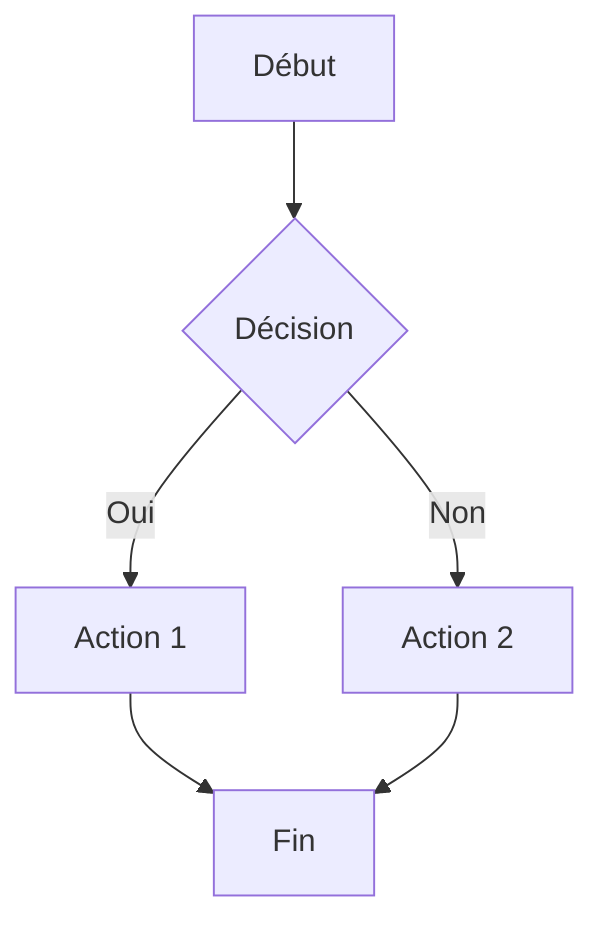
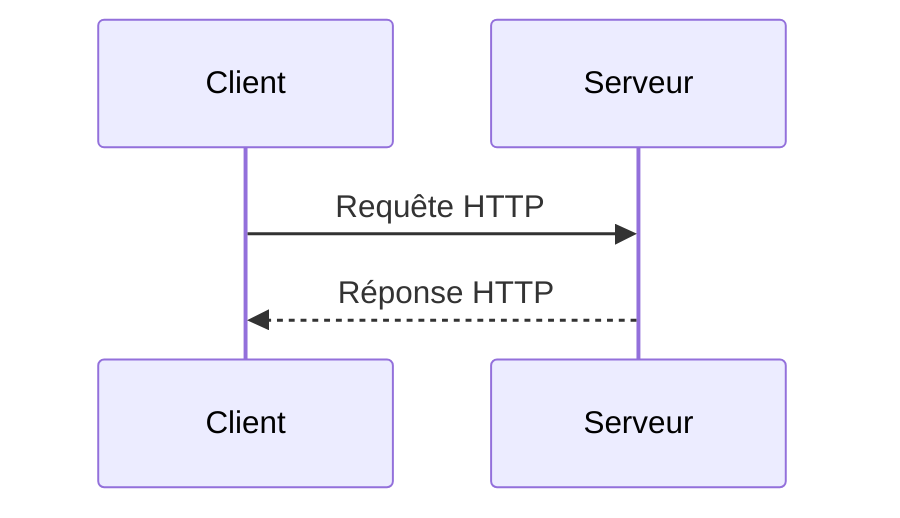

# Markdown

## Introduction

Le markdown est un langage de balisage léger créé par John Gruber en 2004. Il simplifie la rédaction et la coopération sur des documents avec une syntaxe facile à apprendre et à lire[^1][^2].

**Avantages :**
- Syntaxe simple et lisible
- Bien intégré dans GitHub, GitLab, et autres plateformes
- Conversion facile vers HTML, PDF, etc.
- Idéal pour la documentation de projets

## Syntaxe Markdown standard

### Titres

```markdown
# Titre niveau 1
## Titre niveau 2
### Titre niveau 3
#### Titre niveau 4
##### Titre niveau 5
###### Titre niveau 6
```

**Résultat :**

# Titre niveau 1
## Titre niveau 2
### Titre niveau 3

### Emphase

```markdown
*italique* ou _italique_
**gras** ou __gras__
***gras et italique***
~~barré~~
```

**Résultat :**

*italique* ou _italique_
**gras** ou __gras__
***gras et italique***
~~barré~~

### Listes

**Liste non ordonnée :**

```markdown
- Élément 1
- Élément 2
  - Sous-élément 2.1
  - Sous-élément 2.2
- Élément 3
```

**Résultat :**

- Élément 1
- Élément 2
  - Sous-élément 2.1
  - Sous-élément 2.2
- Élément 3

**Liste ordonnée :**

```markdown
1. Premier élément
2. Deuxième élément
3. Troisième élément
```

**Résultat :**

1. Premier élément
2. Deuxième élément
3. Troisième élément

### Liens

```markdown
[Texte du lien](https://www.example.com)
[Lien avec titre](https://www.example.com "Titre du lien")
```

**Résultat :**

[Documentation Markdown](https://daringfireball.net/projects/markdown/syntax)
[GitHub](https://github.com "Plateforme de développement")

### Images

```markdown


```

### Code

**Code inline :**

```markdown
Utilisez la commande `git status` pour voir l'état du dépôt.
```

**Résultat :**

Utilisez la commande `git status` pour voir l'état du dépôt.

**Bloc de code :**

````markdown
```python
def bonjour(nom):
    print(f"Bonjour {nom}!")

bonjour("Claude")
```
````

**Résultat :**

```python
def bonjour(nom):
    print(f"Bonjour {nom}!")

bonjour("Claude")
```

### Citations

```markdown
> Ceci est une citation.
> Elle peut s'étendre sur plusieurs lignes.
>
> > Citation imbriquée
```

**Résultat :**

> Ceci est une citation.
> Elle peut s'étendre sur plusieurs lignes.
>
> > Citation imbriquée

### Ligne horizontale

```markdown
---
***
___
```

**Résultat :**

---

### Tableaux

```markdown
| En-tête 1 | En-tête 2 | En-tête 3 |
|-----------|-----------|-----------|
| Ligne 1   | Donnée A  | Donnée B  |
| Ligne 2   | Donnée C  | Donnée D  |
```

**Résultat :**

| En-tête 1 | En-tête 2 | En-tête 3 |
|-----------|-----------|-----------|
| Ligne 1   | Donnée A  | Donnée B  |
| Ligne 2   | Donnée C  | Donnée D  |

**Alignement des colonnes :**

```markdown
| Gauche | Centre | Droite |
|:-------|:------:|-------:|
| A      | B      | C      |
| D      | E      | F      |
```

**Résultat :**

| Gauche | Centre | Droite |
|:-------|:------:|-------:|
| A      | B      | C      |
| D      | E      | F      |

## Extensions GitHub Flavored Markdown (GFM)

GitHub utilise une version étendue du Markdown appelée GitHub Flavored Markdown[^3], qui ajoute des fonctionnalités supplémentaires.

### Listes de tâches

```markdown
- [x] Tâche terminée
- [ ] Tâche en cours
- [ ] Tâche à faire
```

**Résultat :**

- [x] Tâche terminée
- [ ] Tâche en cours
- [ ] Tâche à faire

### Mentions et références

```markdown
@username - Mentionner un utilisateur
#123 - Référencer une issue ou pull request
SHA-1: a5c3785ed8d6a35868bc169f07e40e889087fd2e
```

**Résultat :**

@username
#123
SHA-1: a5c3785ed8d6a35868bc169f07e40e889087fd2e

### Emojis

```markdown
:smile: :heart: :thumbsup: :rocket: :fire:
```

**Résultat :**

:smile: :heart: :thumbsup: :rocket: :fire:

Liste complète : [GitHub Emoji Cheat Sheet](https://github.com/ikatyang/emoji-cheat-sheet)

### Code avec coloration syntaxique

GitHub supporte plus de 100 langages pour la coloration syntaxique :

````markdown
```javascript
const salutation = (nom) => {
    console.log(`Bonjour ${nom}!`);
};

salutation("Monde");
```
````

**Résultat :**

```javascript
const salutation = (nom) => {
    console.log(`Bonjour ${nom}!`);
};

salutation("Monde");
```

### Blocs de code avec numéros de ligne

````markdown
```python
def factorielle(n):
    if n <= 1:
        return 1
    return n * factorielle(n-1)

print(factorielle(5))  # Résultat: 120
```
````

**Résultat :**

```python
def factorielle(n):
    if n <= 1:
        return 1
    return n * factorielle(n-1)

print(factorielle(5))  # Résultat: 120
```

### Notes de bas de page

```markdown
Voici une phrase avec une note de bas de page[^1].

[^1]: Ceci est le contenu de la note de bas de page.
```

**Résultat :**

Voici une phrase avec une note de bas de page[^note].

[^note]: Ceci est le contenu de la note de bas de page.

### Alertes (GitHub 2023)

```markdown
> [!NOTE]
> Information utile que les utilisateurs devraient connaître.

> [!TIP]
> Conseil utile pour faire les choses mieux ou plus facilement.

> [!IMPORTANT]
> Information cruciale nécessaire à la réussite des utilisateurs.

> [!WARNING]
> Contenu critique nécessitant une attention immédiate en raison de risques potentiels.

> [!CAUTION]
> Conséquences négatives potentielles d'une action.
```

**Résultat :**

> [!NOTE]
> Information utile que les utilisateurs devraient connaître.

> [!TIP]
> Conseil utile pour faire les choses mieux ou plus facilement.

> [!IMPORTANT]
> Information cruciale nécessaire à la réussite des utilisateurs.

> [!WARNING]
> Contenu critique nécessitant une attention immédiate en raison de risques potentiels.

> [!CAUTION]
> Conséquences négatives potentielles d'une action.

### Détails repliables

```markdown
<details>
<summary>Cliquez pour développer</summary>

### Contenu caché

Vous pouvez ajouter du texte, du code, des images, etc.

```python
print("Ce code est caché par défaut")
```

</details>
```

**Résultat :**

<details>
<summary>Cliquez pour développer</summary>

### Contenu caché

Vous pouvez ajouter du texte, du code, des images, etc.

```python
print("Ce code est caché par défaut")
```

</details>

### Diagrammes Mermaid

GitHub supporte les diagrammes Mermaid depuis 2022 :

````markdown

````

**Résultat :**


**Diagramme de séquence :**

````markdown

````

**Résultat :**


### Fichiers GeoJSON et TopoJSON

GitHub peut afficher des cartes à partir de fichiers `.geojson` et `.topojson` :

```json
{
  "type": "FeatureCollection",
  "features": [
    {
      "type": "Feature",
      "geometry": {
        "type": "Point",
        "coordinates": [2.3522, 48.8566]
      },
      "properties": {
        "name": "Paris"
      }
    }
  ]
}
```

### Formules mathématiques (LaTeX)

GitHub supporte les formules mathématiques avec la syntaxe LaTeX :

**Inline :**

```markdown
L'équation $E = mc^2$ est célèbre.
```

**Résultat :**

L'équation $E = mc^2$ est célèbre.

**Bloc :**

```markdown
$$
\frac{-b \pm \sqrt{b^2 - 4ac}}{2a}
$$
```

**Résultat :**

$$
\frac{-b \pm \sqrt{b^2 - 4ac}}{2a}
$$

### Tableaux avancés

```markdown
| Commande | Description | Exemple |
|----------|-------------|---------|
| `git init` | Initialise un dépôt | `git init mon-projet` |
| `git clone` | Clone un dépôt | `git clone https://...` |
| `git status` | Affiche l'état | `git status` |
```

**Résultat :**

| Commande | Description | Exemple |
|----------|-------------|---------|
| `git init` | Initialise un dépôt | `git init mon-projet` |
| `git clone` | Clone un dépôt | `git clone https://...` |
| `git status` | Affiche l'état | `git status` |

### Liens automatiques

GitHub crée automatiquement des liens pour :

```markdown
https://github.com
user@example.com
```

**Résultat :**

https://github.com
user@example.com

## Bonnes pratiques

1. **Structurez votre document** avec des titres hiérarchiques
2. **Utilisez des listes** pour améliorer la lisibilité
3. **Ajoutez des exemples de code** avec coloration syntaxique
4. **Créez une table des matières** pour les longs documents
5. **Utilisez les alertes** pour mettre en évidence des informations importantes
6. **Testez le rendu** sur GitHub avant de publier

## Ressources

- [Syntaxe Markdown originale](https://daringfireball.net/projects/markdown/syntax) - John Gruber
- [GitHub Flavored Markdown Spec](https://github.github.com/gfm/) - Spécification officielle
- [Documentation GitHub](https://docs.github.com/fr/get-started/writing-on-github/getting-started-with-writing-and-formatting-on-github/basic-writing-and-formatting-syntax) - Guide officiel
- [Markdown Guide](https://www.markdownguide.org/) - Guide complet et tutoriels

---

[^1]: Gruber, J. (2004). *Markdown*. Daring Fireball. https://daringfireball.net/projects/markdown/
[^2]: GitHub (2023). *Basic writing and formatting syntax*. https://docs.github.com/en/get-started/writing-on-github
[^3]: GitHub (2023). *GitHub Flavored Markdown Spec*. https://github.github.com/gfm/
